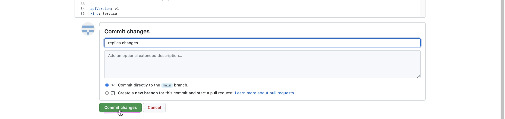

# Deploy iLender app with GitOps using ArgoCD

This document explains GitOps way of deploying iLender application in Dev, Stage and Prod clusters using ArgoCD.

- ArgoCD is installed and available in an Openshift Cluster. 
- iLender app is going to be deployed in `in-cluster`, the Openshift Cluster where ArgoCD is installed.
- The namespaces `ilender-dev-ns`, `ilender-stage-ns` and `ilender-prod-ns` are considered as Dev, Stage and Prod `in-cluster`s .


The article is based on the the following
 - RedHat OpenShift 4.6 on IBM Cloud (ROKS)


## 1. Install ArgoCD

Install OpenShift GitOps (which installs Argo CD) using the url https://github.com/redhat-developer/openshift-gitops-getting-started

The ArgoCD is installed and available in `openshift-gitops` namespace.


## 2. Yamls

### 2.1 iLender application

iLender application yaml files for Dev, Stage and Prod are available here.

[Dev ](dev) 

[Stage ](stage) 

[Prod ](prod) 

### 2.2 ArgoCD application

We need to create an entry (application) in ArgoCD, to point to iLender application. For each Dev, Stage and Prod `in-cluster` of iLender, we need to have separate entry (application) in ArgoCD. Here the yamls to create app in ArgoCD.

[ilender-dev ](argo-app/ilender-dev.yaml) 
[ilender-stage ](argo-app/ilender-stage.yaml) 
[ilender-prod ](argo-app/ilender-prod.yaml) 

The ArgoCD appplication looks like the below.


### 2.3 ServiceAccount for ArgoCD

ArgoCD requires cluster admin rights to access other namespaces to install ilender app. Here is the yaml file for service account.

[ilender-dev ](argo-setup-misc/sa.yaml) 

Service account is created inside `openshift-gitops` namespace as we have ArgoCD installed there.

## 3. Create ServiceAccount in ArgoCD 

Run the below command

```
oc apply -f argo-setup-misc/sa.yaml
```

## 4. Create ArgoCD application

### 4.1. Create ArgoCD application for Dev

Run the below command

```
oc apply -f argo-app/ilender-dev.yaml
```

You might be able to see the app like this in ArgoCD.


### 4.2. Create ArgoCD application for Stage

Run the below command

```
oc apply -f argo-app/ilender-stage.yaml
```

You might be able to see the app like this in ArgoCD.


### 4.3. Create ArgoCD application for Prod

Run the below command

```
oc apply -f argo-app/ilender-prod.yaml
```

You might be able to see the app like this in ArgoCD.


## 5. Deploy iLender

### 5.1 Deploy iLender in Dev

1. Click on sync option to install iLender app in `Dev` in-cluster for the first time.


You might be able to see the app like this in ArgoCD.


2. Run the below command to get url of the app

```
oc get routes -n ilender-dev-ns | grep frontweb | awk '{print $2}'
```

The output would be like this.

```
ilender-frontweb-ilender-dev-ns.aiops-dev-july-4caea77.us-south.containers.appdomain.cloud
```

3. Open the url in the browser and access the application.


### 5.2 Deploy iLender in Stage

1. Click on sync option to install iLender app in `Stage` in-cluster for the first time.

You might be able to see the app like this in ArgoCD.


2. Run the below command to get url of the app

```
oc get routes -n ilender-stage-ns | grep frontweb | awk '{print $2}'
```

3. Open the url in the browser and access the application.


### 5.3. Deploy iLender in Prod

1. Click on sync option to install iLender app in `Prod` in-cluster for the first time.

2. Run the below command to get url of the app

```
oc get routes -n ilender-prod-ns | grep frontweb | awk '{print $2}'
```

3. Open the url in the browser and access the application.


## 6. Deploy iLender based on changes in yaml

### 6.1 Increasing the Replica in Stage cluster

Want to increase the replica to 2 for `ilender-loan` microservice. The ArgoCD will deploy the changes in Stage in-cluster if we sync it. 

Sync option was set to manual, while we create argo-app for dev, stage and prod. So auto sync option to be enabled.

Here is the `ilender-loan` with 1 replica.


1. Update the below yaml for the replica.


2. Commit the changes.


3. To enable the auto-sync, click on the `APP DETAILS`.


4. Click on the `ENABLE AUTO-SYNC`.


The changes are synched and 2 instances of `ilender-loan` is deployed.


### 6.2 Increasing the Replica in Prod cluster

Want to increase the replica to 3 for `ilender-loan` microservice in Prod cluster. The ArgoCD will deploy the changes in Prod in-cluster during the sync.


1. Update the below yaml for the replica.


2. Commit the changes.



3. To enable the auto-sync, click on the `APP DETAILS`.

4. Click on the `ENABLE AUTO-SYNC`.

The changes are synched and 3 instances of `ilender-loan` is deployed.


